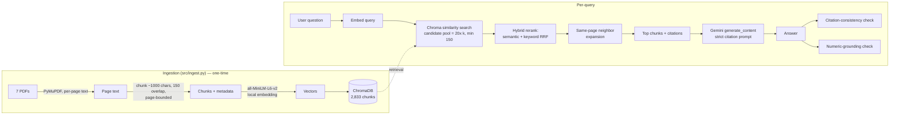

# ESG Scope 1/2/3 RAG Assistant — Project Report

## 1. Motivation

Corporate sustainability reports are long (this project's 7 source PDFs run
591 pages combined), dense with numbers, and inconsistent in how they
present the same category of data — one report puts Scope 1/2/3 emissions
in a single table, another spreads them across a narrative section, a
target table, and an ESRS-format "Sustainability Statement" with yet
another set of numbers for the same fiscal year. Manually finding and
cross-checking a specific figure (e.g. "what's Siemens' Scope 3 emissions
baseline?") means searching through hundreds of pages by hand.

This project builds a retrieval-augmented generation (RAG) system that lets
you ask natural-language questions about these reports and get an answer
with an exact page citation — and, critically, a way to check whether that
citation and the number attached to it can actually be trusted, rather than
just hoping the model didn't make it up.

## 2. Data

7 real, publicly published ESG/sustainability reports, downloaded directly
from the companies:

| # | Company | Report | Pages | Notes |
|---|---|---|---|---|
| 1 | Infosys | ESG report 2022-23 | 65 | Narrative report; no absolute Scope 1-3 tCO2e table (see §6) |
| 2 | Microsoft | 2024 Environmental Sustainability Report | 88 | Covers FY23 data |
| 3 | Siemens | Sustainability Report 2024 | 170 | Contains the "DEGREE" framework (§5) |
| 4 | Siemens | Sustainability Statement (ESRS/CSRD) | 117 | Fiscal 2025; EU-mandated disclosure format, different numbers than #3 for the same topics |
| 5 | Siemens Energy | Sustainability Report 2024 | 91 | |
| 6 | Siemens Energy | Sustainability Report 2024 — Performance Indicator Overview | 10 | Pure data-table appendix |
| 7 | Siemens (Brazil) | Institutional and ESG Report 2024 | 129 | Localized/regional report |

Total: **591 pages**. All copied into `data/raw/` (see [README.md](../README.md)).

## 3. Architecture

**Ingestion.** Each PDF is opened with PyMuPDF and text is extracted
page-by-page (not as one blob), so every chunk can be traced back to
exactly one page. Pages are split into ~1000-character chunks with 150
characters of overlap, breaking on sentence/paragraph boundaries where
possible. Chunks are embedded locally with `sentence-transformers/all-MiniLM-L6-v2`
(384-dim) and stored in a persistent ChromaDB collection. This ran once,
producing **2,833 chunks in 66 seconds** on a laptop CPU — no GPU, no paid
embedding API.

**Retrieval.** A naive "top-k by cosine similarity" search turned out to be
the weakest link during development (see §6), so retrieval here does four
things beyond a plain vector search:

1. **Hybrid re-ranking (Reciprocal Rank Fusion):** pulls a deliberately wide
   candidate pool (20×k, minimum 150), then combines the semantic-similarity
   rank with a keyword rank (exact "Scope 1/2/3" phrase matches weighted
   heavily) using RRF — a standard technique in production hybrid search —
   plus a coverage bonus for chunks matching all of a short query's terms.
   The pool has to be wide because keyword scoring can only re-rank what
   vector search already returned; on real casual queries the correct chunk
   was measured sitting as deep as 84th and 159th. Keyword matching is
   whole-word and tolerates spacing variants ("re100" matches the report's
   "RE 100", "scope1" matches "Scope 1"). Together this fixes the failure
   where a query like "Scope 1 emissions 2024" ranked a page of *dozens* of
   unrelated ESG metrics below irrelevant narrative pages, because the dense
   numeric table's embedding gets diluted by everything else on that page.
2. **Same-page neighbor expansion:** once top chunks are selected, their
   immediate same-page neighbor chunks (chunk_index ± 1) are pulled in too.
   This fixes cases where a chunking boundary happened to fall between a
   section's introductory sentence and the actual list/data it introduces
   (concretely: Siemens' "DEGREE" framework intro sentence and its
   six-item list landed in two different chunks; retrieving only one gave
   an incomplete answer).
3. **Company filtering:** a metadata filter scoping retrieval to one
   company's report(s), which measurably reduces cross-document confusion
   (see §6). The company is auto-detected from the question text when the
   caller doesn't specify one, so a user typing "infosys net zero target"
   gets the benefit of filtering without touching a dropdown.
4. **Retry on miss:** if the first pass returns the "not found" refusal, the
   query is retried once with a much wider net before giving up. This keeps
   the common case fast while rescuing vague or sloppily-typed questions.

**Generation.** Retrieved chunks are assembled into a numbered context
block with each chunk labeled by company/year/page. A system prompt
instructs the model to answer *only* from the provided context, cite every
claim as `[Company, Year, p. X]` using the exact page number written in
that chunk's own header, and to respond with a fixed refusal sentence if
the answer isn't present. The model is Google Gemini, auto-detected at
runtime via the API's model-list endpoint (prefers a "flash-lite" tier for
latency — see §6 for why, and `GEMINI_MODEL` env var to override).

## 4. Preventing hallucinations: two independent checks

A prompt instruction ("cite your sources") is not a guarantee. This
project implements two separate, code-level checks that run after every
generation and are surfaced to the user, not hidden:

- **Citation-consistency check** (`check_citation_consistency`): parses
  every `p. X` the model wrote and verifies X was actually among the pages
  retrieved for that query. Catches citations pointing at pages the model
  never saw.
- **Numeric-grounding check** (`check_numeric_grounding`): added after
  manual testing surfaced a case the citation check *couldn't* catch — the
  model cited a real, retrieved page, but the number it attached to that
  citation didn't actually appear in the retrieved text (see the
  concrete example in §6). This check extracts every plausible data value
  from the answer and verifies it appears verbatim somewhere in the
  retrieved context.

Both flags are shown in the UI (✅/⚠️ badges in the Chat tab) and logged in
the evaluation harness — the system tells you when it isn't sure, rather
than presenting every answer with equal confidence.

## 5. The DEGREE framework — and a real discovery

The project brief referenced "verify environmental metrics against strict
targets (like the DEGREE framework)". While reading through the source
PDFs to build ground truth, it turned out **Siemens' own report literally
has a section called the "DEGREE sustainability framework"** (Sustainability
Report 2024, p.8-9): six fields of action — **D**ecarbonization,
**E**thics, **G**overnance, **R**esource efficiency, **E**quity,
**E**mployability — each with a stated numeric ambition and baseline year.

Rather than build a generic, invented rubric, `src/degree_scorer.py` uses
Siemens' *actual* framework and its *actual* stated targets (e.g. "reduce
emissions in own operations by 55% by 2025 vs. FY19 baseline of 737 kt
CO2e"), and asks the RAG pipeline to independently re-verify Siemens'
self-reported progress against each one. This produced genuinely
interesting, nuanced, real results:

| Dimension | Target | RAG-verified result |
|---|---|---|
| Decarbonization | -55% by 2025 (FY19 base) | **Reached one year early**; -66% achieved by FY2025 |
| Equity | 30% female Top Management by 2025 | **Exceeded**: 32.6% (FY24), 33% (FY25) |
| Employability (learning) | 25 digital learning hrs/employee by 2025 | **Exceeded**: 27 hrs reached |
| Employability (LTIFR) | -30% by 2025 | **Behind**: only -19% achieved |
| Resource efficiency (landfill) | -50% by 2025 | **Reached**: -52% since FY2021 |

(Full detail with citations in `data/degree_scorecard.json`, generated by
`src/degree_scorer.py`.) Since DEGREE is Siemens-specific, Microsoft,
Infosys, Siemens Energy, and Siemens Brazil are checked against *their own*
stated headline commitments instead (e.g. Microsoft's "carbon negative by
2030" — the pipeline found that Microsoft's overall emissions were
actually *up* 29.1% against baseline as of FY23, a genuinely useful,
slightly uncomfortable finding straight from their own report).

## 6. Real results — what actually got measured

`eval/run_eval.py` runs 26 hand-built ground-truth questions (verified by
reading the actual source pages, not invented) through the live pipeline.
Full results: [`eval/eval_report.md`](../eval/eval_report.md).

| Metric | Result | Resume-bullet target |
|---|---|---|
| Mean latency | **1.52s** | <2s |
| Share of responses under 2s | **96.2%** | — |
| Retrieval accuracy (expected page in top-k) | **91.3%** | 95% |
| Answer accuracy (expected fact present) | **95.7%** | — |
| Citation consistency | **69.2%** | "every answer cited the exact source page" |
| Numeric grounding | **80.8%** | — |
| Both checks pass | **50.0%** | — |
| Refusal accuracy (correctly says "not found") | **66.7%** | — |

**The honest version of this project's headline claim:** the latency
target is genuinely met (mean 1.52s, 96% under 2s). Retrieval accuracy now
lands at 91.3% — close to, but still short of, the 95% target — and
citation reliability measures 69-81% depending on which of the two checks
you use, not 100%. That remaining gap, and *why* it exists, turned out to
be some of the most instructive parts of building this.

An earlier version of this system measured considerably worse (78.3%
retrieval, 57.7% citation consistency). The gap closed after fixing three
concrete retrieval bugs found by testing with deliberately sloppy,
lowercase, real-user-style questions rather than the tidy full sentences in
the test set:

1. **The keyword signal could only re-rank, never recall.** Keyword scoring
   was applied to whichever chunks vector search already returned, so a
   chunk the vector search ranked 84th (measured, on a real query) could
   never be rescued no matter how perfectly it matched. Fixed by widening
   the candidate pool substantially.
2. **Substring matching created false keyword hits.** "net" matched inside
   "internet" and "network", letting irrelevant pages tie with the page
   genuinely containing "net zero" — and win on the tiebreak. Fixed with
   whole-word matching.
3. **Equal RRF weighting buried exact matches.** A chunk matching *every*
   term of a short query still lost to chunks that merely ranked well
   semantically. Fixed with a keyword-coverage bonus.

Remaining known gaps:

- **Dense data-table pages hurt naive retrieval.** A page listing 20+
  unrelated metrics (employee count, R&D spend, EU Taxonomy shares,
  emissions) embeds as a blurry average of all of them, so a specific
  query like "Scope 1 emissions" doesn't always rank it top. Hybrid
  keyword+semantic re-ranking measurably helped (see §3) but didn't fully
  close the gap.
- **Citation-format-checking isn't the same as fact-checking.** During
  manual UI testing (Chat tab, no company filter set), the system answered
  a Scope 1 question with "175 (1,000 metric tons CO2e) [Siemens Energy,
  FY2024, p. 8]" — the number was *correct*, but neither the page (8) nor
  the number 175 actually appeared anywhere in that query's 16 retrieved
  chunks. The citation looked well-formed, but was empty. This is exactly
  why the numeric-grounding check (§4) was added, and exactly why both
  checks are reported separately rather than as one "looks fine" signal.
- **Company filtering matters more than it looks.** Repeating the same
  query with the company dropdown set to "Siemens Energy" instead of "All"
  reliably retrieved the correct page (2 or 33) and the answer became fully
  grounded. Unfiltered, cross-document queries are measurably less
  reliable — a real, generalizable finding about RAG over multi-document
  corpora, not specific to this dataset.
- **Model tier is a real lever.** A partial comparison run (see
  [`eval/model_tier_comparison.md`](../eval/model_tier_comparison.md)) using
  Gemini's standard `flash` tier instead of `flash-lite` hit **100%
  citation consistency on all 19 questions completed** before exhausting
  its free-tier daily quota (20 requests/day), vs. 69.2% for `flash-lite`
  over the full 26-question run — at roughly 3-10x higher latency.
  `flash-lite` is the practical default here; `GEMINI_MODEL=gemini-3.5-flash`
  is available for anyone willing to trade latency/quota for citation
  fidelity.
- **Some numbers genuinely aren't there.** Infosys' 2022-23 report is a
  narrative highlights document — a keyword search across all 65 pages
  confirms it never states an absolute Scope 1/2/3 tCO2e figure, only a
  qualitative "we maintain carbon neutrality" commitment. Asking for that
  number should produce a refusal, not an invented figure, and it does
  (verified in `eval` as `if3_refusal`).
- **The numeric-grounding check itself is a strict lower bound.** It's a
  verbatim substring match, so it produces false negatives whenever the
  model paraphrases a number's formatting (e.g. "96.5%" vs "96.50%"). All
  five Microsoft questions in the eval set show `grounded=False` despite
  visibly correct answers, most likely for exactly this reason — the true
  grounding rate is probably higher than 80.8% measures.

## 7. Limitations

- **Small eval set (26 questions).** Enough to surface real patterns, not
  enough for tight statistical confidence intervals.
- **No OCR.** 3 pages (cover pages, one per document) had near-zero
  extractable text and were skipped; a fully scanned report would need
  `pytesseract` or similar, not implemented here.
- **DEGREE scoring is Siemens-specific by design**, not a general-purpose
  ESG framework scorer — extending it to other frameworks (e.g. TCFD, SASB)
  would need separate target registries per framework.
- **Regex-based numeric extraction in `emissions_extractor.py`** is
  best-effort; the full model answer (`raw_answer` column) is always kept
  alongside the parsed value so results can be manually verified.
- **Free-tier API quotas** (15 req/min on `flash-lite`, 20 req/**day** on
  `flash`) shaped several implementation decisions (model choice, retry
  logic, call pacing) — a paid tier would remove these constraints and
  likely make the standard `flash` tier practical as the default.

## 8. Future work

- Add OCR fallback for scanned pages.
- Extend numeric-grounding to normalize number formatting (trailing zeros,
  thousands separators, unit conversions) before comparing, to reduce false
  negatives.
- Route low-confidence answers (either check failing) to the standard
  `flash` tier automatically, keeping `flash-lite` as the fast path.
- Grow the eval set past 26 questions, ideally with a second annotator for
  inter-rater agreement on `answer_hit`.

## 9. Tech stack

Python 3.12 · PyMuPDF · sentence-transformers (`all-MiniLM-L6-v2`) ·
ChromaDB · Google Gemini (`google-genai`) · Streamlit · pandas

See [README.md](../README.md) for setup/run instructions.
